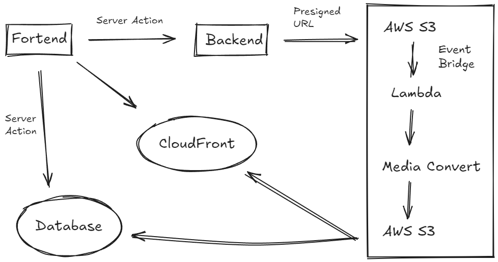

# Serverless HLS VOD Application

**基于 Next.js 15 与 AWS Serverless 架构的视频点播应用**

---

## ✨ 核心功能

### 1. 异步云端转码工作流

* **安全直传：** 前端使用 **S3 预签名URL (Presigned URL)** 实现安全、无后端的客户端文件直传。
* **事件驱动：** 利用 **S3 事件通知** 与 **EventBridge** 搭建**事件驱动架构**，实现上传-转码-回写的流程自动化。
* **自动转码：** **AWS Lambda** 自动响应S3事件，调用 **MediaConvert** 将源视频高效转码为 **HLS (HTTP Live Streaming)**
  格式，以支持多码率播放。

### 2. 流媒体播放

* **自适应码率 (ABR)：** 集成 `hls.js` ，实现 HLS 协议播放，优化播放体验。
* **状态管理：** 使用 `SWR` 进行状态管理与数据缓存，支持**乐观更新 (Optimistic UI)**。

### 3. 用户管理

* **用户认证：** 基于 `NextAuth` 的会话管理，支持邮箱、OAuth。
* **内容管理：** 独立的“创作者中心”，用于管理视频状态、编辑元数据。
* **用户交互：** 嵌套评论、回复及点赞系统。

---

## 🛠 技术栈

🚀 **前端**

- Next.js 15 (App Router)
- React 19
- TypeScript
- shadcn/ui
- TailwindCSS
- hls.js
- SWR

🖥️ **后端**

- Next.js API Routes
- Prisma ORM
- NextAuth

💾 **数据库**

- PostgreSQL (Supabase)

☁️ **云架构与部署**

- AWS S3 (对象存储)
- AWS Lambda (无服务器计算)
- AWS EventBridge (事件总线)
- AWS MediaConvert (媒体转码)
- Vercel (前端部署)

---

## 🏛️ 架构图

